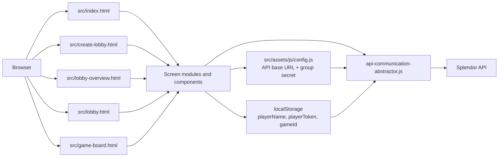

<div align="center">

# 📌 Splendor Client

**A Splendor web client built with static HTML, modular vanilla JavaScript, and feature-specific CSS.**

<p>
	
	
	
	
	
	
</p>

</div>

> 🎓 Created for the Howest 2024-2025 programming project, group 11.

## 📑 Table of Contents

- [📖 About](#about)
- [🏗️ Architecture](#architecture)
- [✨ Features](#features)
- [🛠️ Tech Stack](#tech-stack)
- [🚀 Getting Started](#getting-started)
- [📡 Usage](#usage)
- [👤 Author](#author)

## 📖 About

- This repository contains the frontend client for the Splendor web project.
- It serves multiple screens for profile selection, lobby management, and gameplay.
- The app talks to the Splendor API through a small fetch wrapper that adds the required headers and player token when available.

## 🏗️ Architecture



## ✨ Features

- Profile selection and avatar switching from the start screen.
- Lobby creation, lobby browsing, joining, leaving, and spectating.
- Gameplay board with popups for buying, reserving, token selection, settings, and end-game states.
- Browser-side persistence for player name, player token, and game id.
- HTML validation and Sonar analysis are available through the project scripts.

## 🛠️ Tech Stack

| Area | Technologies |
| --- | --- |
| Markup | HTML5 |
| Styling | CSS3, reset stylesheet, feature-specific stylesheets |
| Client logic | Vanilla JavaScript, ES modules |
| Browser APIs | Fetch API, localStorage |
| Tooling | Node.js, npm |
| Validation | vnu-jar, SonarScanner |

## 🚀 Getting Started

### Prerequisites

- Node.js and npm
- Access to the Splendor API used by the client
- A browser and a static file server for local preview

### Clone

```bash
git clone git@gitlab.ti.howest.be:ti/2024-2025/s2/programming-project/students/group-11/client.git
cd client
```

### Configuration

Configuration is defined in [src/assets/js/config.js](src/assets/js/config.js). There are no verified `.env` files or runtime environment variables in this repository.

| Variable | Description |
| --- | --- |
| `GROUPNUMBER` | Group identifier used in deployment and the group-specific API URL. |
| `GROUPTOKEN` | Secret added as the `X-Group-Secret` header on API requests. |
| `LOCALSERVER` | Local API URL kept in code. |
| `DEPLOYEDSERVER` | Splendor API URL kept in code for the shared deployment. |
| `GROUPDEPLOYEDSERVER` | Group-specific API URL returned by `getAPIUrl()`. |

### Run

```bash
npm install
npm run validate-html
npm run validate-ci
npm test
```

<!-- TODO: add a verified local preview command if one is introduced in package.json. -->

## 📡 Usage

### API Endpoints

All requests go through the wrapper in [src/assets/js/data-connector/api-communication-abstractor.js](src/assets/js/data-connector/api-communication-abstractor.js), which sets `Content-Type: application/json`, adds `X-Group-Secret`, and adds `Authorization: Bearer <playerToken>` when a token exists in localStorage.

| Method | Route | Description |
| --- | --- | --- |
| `GET` | `/gems` | Connectivity check used by the start screen. |
| `GET` | `/games` | Load the lobby overview. |
| `POST` | `/games` | Create a new lobby. |
| `GET` | `/games/{gameId}` | Load the current game state. |
| `POST` | `/games/{gameId}/players/{playerName}` | Join a lobby or spectate it, depending on the request body. |
| `POST` | `/games/{gameId}/players/{playerName}/reserve` | Reserve a development card. |
| `POST` | `/games/{gameId}/players/{playerName}/developments` | Buy a development card. |
| `DELETE` | `/games/{gameId}/players/{playerName}/reserve/{cardName}` | Buy a reserved card. |
| `POST` | `/games/{gameId}/players/{playerName}/nobles` | Claim a noble. |
| `PATCH` | `/games/{gameId}/players/{playerName}/tokens` | Update player tokens. |

## 👤 Author

| Name | GitHub | LinkedIn |
| --- | --- | --- |
| Maurice De Kegel | [MriceDK](https://github.com/MriceDK) | <!-- TODO: verify LinkedIn profile URL --> |

<!-- TODO: confirm the LinkedIn link before publishing this README externally. -->